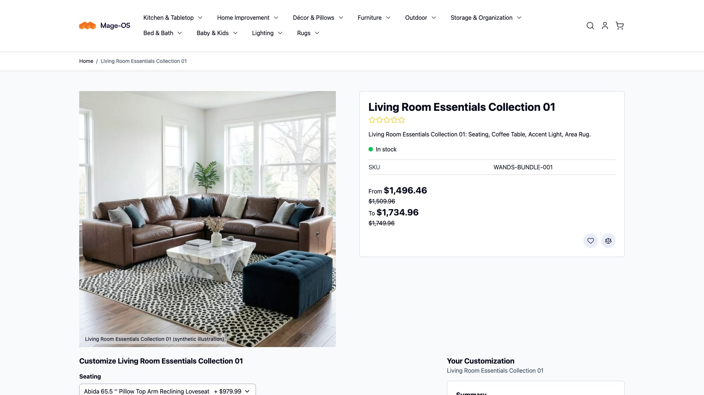
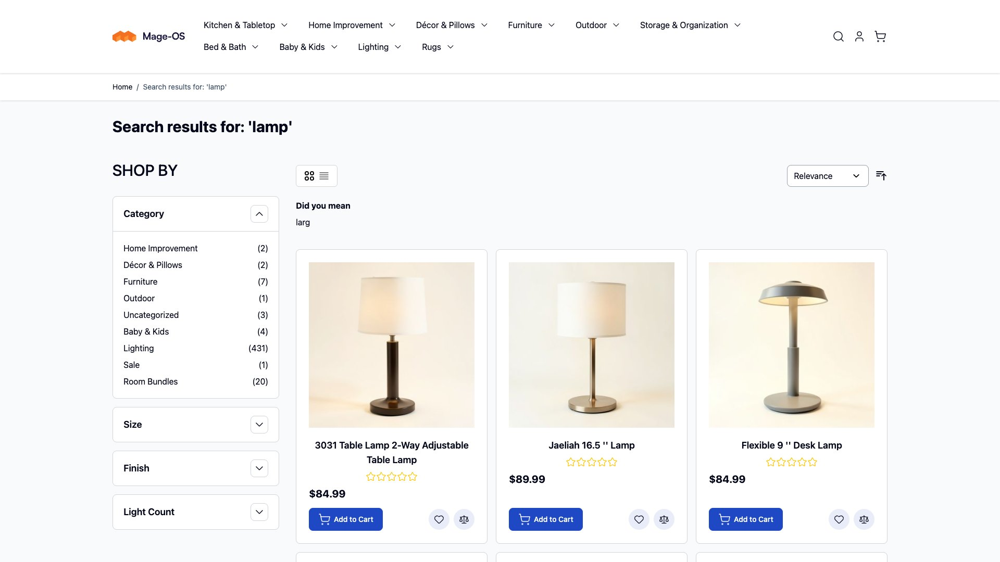
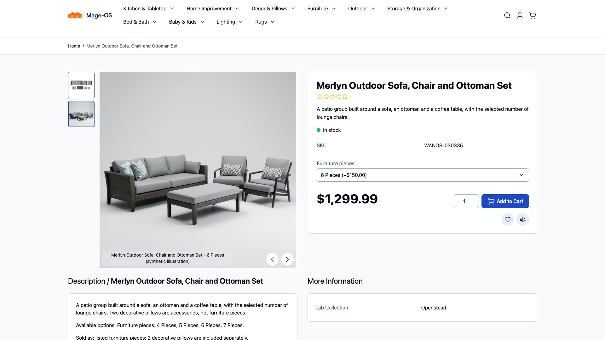
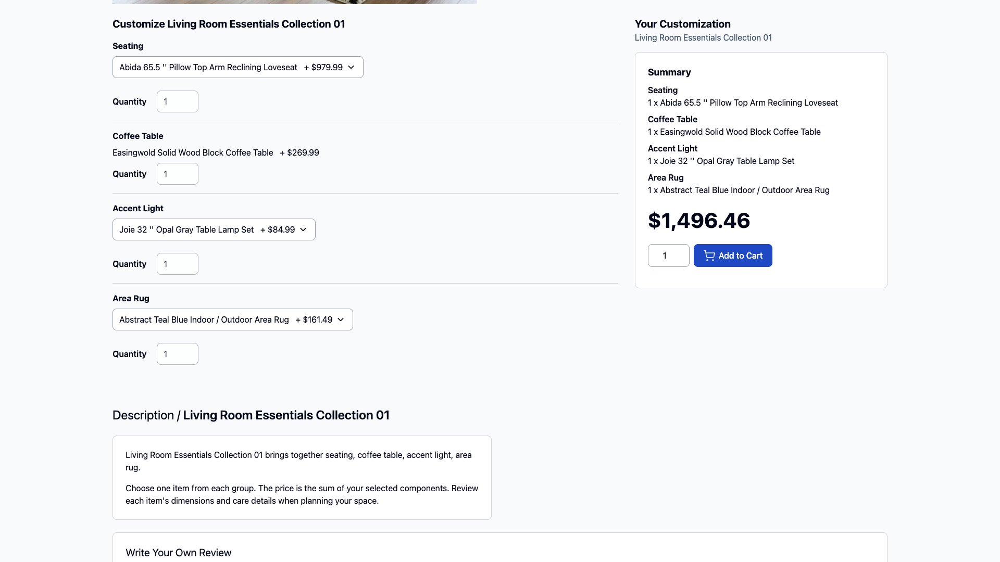

# Mage-OS large demo catalog

A home-and-furniture test catalog for Mage-OS: **53,844 product records, 1,995
configurable products, 50 bundles and 46,602 generated images.** Built from
[Wayfair WANDS](https://github.com/wayfair/WANDS), with synthetic prices, inventory,
variants, assortments and product descriptions.

Use it to develop storefronts, exercise search and filters, test product options,
or work with a catalog larger than standard sample data. Start with 27 products
to check your installation, or choose the full catalog for scale testing.



*The full catalog on Mage-OS 3.5.0 with Hyvä Default 1.5.2. Images are synthetic
illustrations; the selected bundle components, not the room styling, define what
is included. Hyvä is installed separately; no image-generation service is needed.*

[Quick start](#quick-start) · [Installation](#install-into-mage-os) ·
[Screenshots](#screenshots) · [Data and licensing](#data-and-licensing) ·
[Contributing](#contributing)

## Choose a catalog

| | Starter | Full |
| --- | ---: | ---: |
| Product records | 27 | 53,844 |
| Simple products, including variant children | 23 | 51,799 |
| Configurable parents | 3 | 1,995 |
| Bundle products | 1 | 50 |
| Configurable parent-child links | 10 | 10,736 |
| Bundle options / selections | 4 / 12 | 200 / 600 |
| Distinct product images | 24 | 46,602 |
| Catalog, module and media download | About 2.2 MB | About 2.3 GB |

The starter includes complete families and every bundle dependency. The full
profile includes disabled legacy records, so these are database counts, not the
number of products visible in a storefront.

Choose **one profile per empty installation**. To move from starter to full,
restore your empty baseline or use a separate database; do not import full over
starter. Downloads resume, but interrupted imports do not.

## Requirements and tested environment

- A dedicated, empty **Mage-OS 3.5.0** installation, without other sample data.
- PHP 8.4 in the Mage-OS environment. The recorded installation used MariaDB
  11.4, OpenSearch 3.1.0 and stock Luma. The screenshot instance now runs Hyvä
  Default 1.5.2 with the same full catalog.
- Python **3.11+** on macOS or Linux for download and archive verification.
- GitHub CLI (`gh`) for the quick-start download, or a browser to save the three
  helper scripts from the release page.
- Space for the download cache, extracted files, imported media, image cache,
  database and search index. The download size is not the installed footprint.

A GPU, API key, Hyvä, Koti and hybrid search are **not required**.
Both profiles were imported and tested on Luma; Hyvä was subsequently installed
and checked on the full-profile instance. This is not a separate fresh-import
test under Hyvä. Mage-OS 3.4, login, checkout and payments are not qualified.
See the [import results](dev/tools/wands_catalog/distribution/ACCEPTANCE.md) and
[Hyvä storefront checks](dev/tools/wands_catalog/distribution/HYVA_ACCEPTANCE.md).

## Quick start

Current prerelease: [catalog-2026.09.12-rc2](https://github.com/rocketweb/mageos-large-demo-catalog/releases/tag/catalog-2026.09.12-rc2).
**Access note:** the repository is currently private. You need repository access
until it is made public. This is community lab test data, not an official
Mage-OS or Wayfair release.

Use the **attached release assets**, not GitHub's automatic “Source code” ZIP or
this repository's root `composer.json`. The root project describes the original
development store; the release includes a separate portable catalog module.

### 1. Download and check the helpers

Run these commands in a new working directory, **outside your Magento root**.
For private access, authenticate with `gh auth login` first. Never paste tokens
into scripts, URLs or command arguments.

```sh
mkdir wands-demo
cd wands-demo

WANDS_REPO=rocketweb/mageos-large-demo-catalog
WANDS_TAG=catalog-2026.09.12-rc2

gh release download "$WANDS_TAG" --repo "$WANDS_REPO" \
  --pattern github_download.py --pattern download.py --pattern release.py

shasum -a 256 github_download.py download.py release.py
```

**Before running the downloaded code**, compare all three hashes with these
release-specific values. Stop if any differs:

```text
12a03e589d890704b9a10dc4b5ecaa22d1499a1692eacadf7f914f40edd9e6c5  github_download.py
1af4c6d081383d0b3401e7ad0630eea69888f6fd8179c73f29ccea3925f63e08  download.py
9d0d17e2ef4e201e93ef717fee65017f5c83e151df7b73c3d5c1de057460b14b  release.py
```

On Linux, `sha256sum` is an alternative to `shasum -a 256`. Keep trusted pins
separately from the downloaded files. A checksum downloaded beside a file alone
does not establish its authenticity.

### 2. Download the tools and your chosen profile

Continue in `wands-demo`. The default below selects the starter:

```sh
WANDS_PROFILE=starter
WANDS_PIN=42bd8400415204b8bc6b8f5ed5cf8adb8156185eca92ff156cd54285bb68b40f
WANDS_TOOLKIT_PIN=248adfcb07286bcdcae2459fea38d902e8cb29f53d0e9cb273fdaac2d7709908
```

For the **full catalog**, replace the first two variables before downloading:

```sh
WANDS_PROFILE=full
WANDS_PIN=9bf76000f3de8816459638ba2f396af805eaaa83c504886000e1b3c32adcf19d
```

Then run each command below. Continue only when the preceding command exits zero:

```sh
python3 github_download.py --repo "$WANDS_REPO" --tag "$WANDS_TAG" \
  --profile toolkit --cache-dir ./cache --manifest-sha256 "$WANDS_TOOLKIT_PIN"
python3 release.py "./cache/$WANDS_TOOLKIT_PIN" \
  --manifest-sha256 "$WANDS_TOOLKIT_PIN" --extract ./toolkit

python3 github_download.py --repo "$WANDS_REPO" --tag "$WANDS_TAG" \
  --profile "$WANDS_PROFILE" --cache-dir ./cache --manifest-sha256 "$WANDS_PIN"
python3 release.py "./cache/$WANDS_PIN" \
  --manifest-sha256 "$WANDS_PIN" --extract ./wands-staging
```

The terminal stays quiet by default. In a second terminal, from `wands-demo`:

```sh
tail -f wands-download.log
```

Rerun the same download command after interruption. Verified files are reused;
partial transfers resume where supported. Each archive's size, SHA-256 and member
inventory must pass verification. Extraction always requires a new directory.
Verification logs are under `cache/<manifest-pin>/verification.log`.

You now have:

```text
wands-demo/
├── toolkit/tools/preflight.php    Current destination check
├── toolkit/docs/                  Installation and license documentation
└── wands-staging/
    ├── module/                    RocketWeb_LabCatalog source
    ├── data/                      Ordered import CSVs and expected counts
    └── media/wands-lab/            Product images, kept outside Git
```

For authentication details and offline alternatives, see
[GitHub release downloads](dev/tools/wands_catalog/distribution/GITHUB_RELEASE.md).

## Install into Mage-OS

Use a fresh lab, not a customer store. Back up the empty database and application
configuration before installation. Run PHP in the Mage-OS environment as its web
filesystem owner, not as root. If using containers, make the extracted files
available inside that environment and use its paths.

From `wands-demo`, run the **current toolkit's** read-only preflight, replacing
the example Magento root with your actual empty installation:

```sh
php ./toolkit/tools/preflight.php --magento-root=/path/to/empty/mageos \
  --data-dir=./wands-staging/data --log-file=./preflight.log
```

This refuses an occupied catalog or conflicting WANDS store codes and logs the
proposed record counts. It does not create a backup. Do not use the older
preflight nested inside the immutable rc2 profile archive.

Then follow the [installation guide](dev/tools/wands_catalog/distribution/README.md#install-into-an-empty-mage-os-instance):

1. Copy `wands-staging/module/` into `app/code/RocketWeb/LabCatalog/`, enable the
   module and run setup in your Mage-OS root.
2. Provision the WANDS website with your own base URL. Configure your web server
   for website code `wands`; the module does not configure DNS, TLS or routing.
3. Copy the data and import media, then import **simples → configurables →
   bundles → media**. Inspect each phase's log before continuing.
4. Curate the ten-department menu, reindex, clean caches and check the storefront
   against the expected counts in `data/counts.json`.

The guide contains the commands and destination paths. Download verification is
not proof of a successful Magento import; check options, prices, stock, search
and images in your installation too.

## Screenshots

Captured from the full-profile Mage-OS 3.5.0/Hyvä Default 1.5.2 installation. These are
actual storefront screenshots, not mockups. Click an image to inspect it.

### Search and layered navigation



### Configurable furniture assortments



### Bundle selection and pricing



[Capture notes](dev/tools/wands_catalog/docs/screenshots/README.md) identify the
pages and selected states. Only documentation screenshots belong in Git; the
tens of thousands of product images remain release assets.

### Use Hyvä in your own lab

The catalog does not install or bundle a theme. Follow the
[official Hyvä installation guide](https://docs.hyva.io/hyva-themes/getting-started/index.html),
then select `Hyva/default` for the WANDS website and store view under
**Content → Design → Configuration**. The screenshots use the default theme,
not a custom child theme or Koti sample data.

For Mage-OS 3.5.0 with Hyvä 1.5.2, also copy this repository's
[Hyvä search layout correction](app/code/RocketWeb/LabCatalog/view/frontend/layout/hyva_catalogsearch_result_index.xml)
into the same module-relative path in your lab. It initializes the lab's Name,
Price and Relevance sort choices before category defaults can be cached. Clean
layout and full-page caches afterward and verify the normal search URL.
This correction is newer than the immutable rc2 module archive; the published
archive has not been replaced. See the [Hyvä test notes](dev/tools/wands_catalog/distribution/HYVA_ACCEPTANCE.md)
for the observed behavior and limits.

## Data and licensing

- **Tooling, catalog module and authored catalog additions:**
  [MIT](dev/tools/wands_catalog/LICENSE.txt).
- **Original WANDS material:** its [MIT notice](dev/tools/wands_catalog/distribution/WANDS-LICENSE.txt)
  and requested citation are retained.
- **Generated catalog images:** [CC0 1.0](dev/tools/wands_catalog/distribution/CC0-1.0.txt)
  to the extent Rocket Web holds the rights. Third-party rights are not waived.
  Historical image-model and reference provenance is incomplete.

Prices, inventory, dimensions, variants and assortments are explicitly synthetic,
not retail offers or manufacturer specifications. Images are illustrations, not
exact geometry or fit evidence. The full profile includes 64 disabled legacy
variants, 20 disabled records without media and 2,010 children using inherited
family illustrations. Every enabled product has an image assignment.

No customers, orders, credentials, database dump, model weights, Mage-OS vendor
tree or theme packages are included. This derived catalog is **not the original
WANDS benchmark**: its relevance judgments do not validate search rankings on
rewritten products.

Read the [dataset card](dev/tools/wands_catalog/distribution/DATA_CARD.md) and
[distribution terms](dev/tools/wands_catalog/distribution/TERMS.md) for details.

If using WANDS in research, retain the upstream citation:

> Yan Chen, Shujian Liu, Zheng Liu, Weiyi Sun, Linas Baltrunas, and Benjamin
> Schroeder. 2022. *WANDS: Dataset for Product Search Relevance Assessment.*
> Proceedings of the 44th European Conference on Information Retrieval.

[BibTeX](dev/tools/wands_catalog/distribution/CITATION.bib)

## Troubleshooting

| Symptom | What to check |
| --- | --- |
| GitHub returns 404 or denies access | Confirm repository access and `gh auth status`. Current assets are private. |
| The download seems silent | Tail `wands-download.log`; silence is intentional. Check the exit code. |
| Extraction refuses a directory | Use a new staging directory. Do not extract over an earlier attempt or into Magento. |
| Preflight refuses the destination | Use an empty installation without existing WANDS website, store or store-group codes. |
| Import stops partway through | Keep the log, restore the empty baseline and retry. Download resume does not apply to imports. |
| The default store is empty | Route the storefront to `MAGE_RUN_TYPE=website` and `MAGE_RUN_CODE=wands`. |
| Products or images are missing | Check all four import logs, file ownership, indexing and the media destination in the installation guide. |

## Contributing

Work on the portable module and tooling, not the original development store's
Composer stack:

- [Catalog module](app/code/RocketWeb/LabCatalog/)
- [Catalog preparation and image tooling](dev/tools/wands_catalog/README.md)
- [Release builder](dev/tools/wands_catalog/distribution/BUILDING.md)
- [Tests](dev/tools/wands_catalog/tests/)

From the repository root, run the Python test suite. The log is quiet by default:

```sh
python3 -m unittest discover -s dev/tools/wands_catalog/tests -p 'test_*.py' \
  > /tmp/wands-tests.log 2>&1
```

Some checks require PHP or opt-in local HTTPS fixtures; skipped checks do not
establish runtime compatibility. Include the release tag, profile, Mage-OS/PHP
versions and a redacted failing log when reporting an issue. Keep catalog media,
credentials, local environment files and database exports out of commits.
