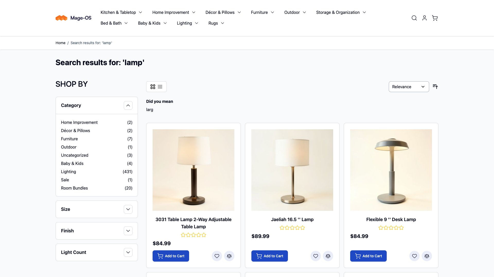
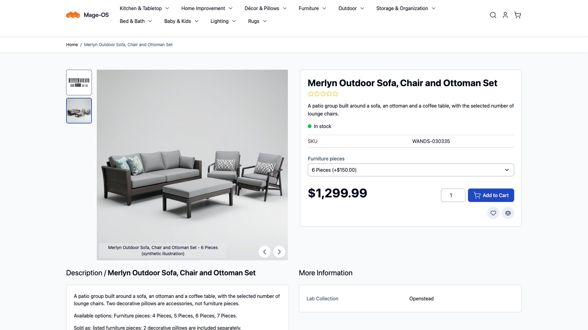
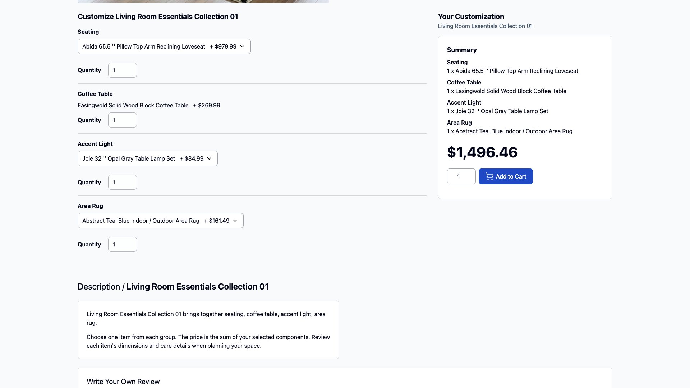

# Mage-OS large demo catalog

A synthetic home-and-furniture catalog for testing Mage-OS storefronts, search,
filters, product options, prices, inventory and product media. Derived from
[Wayfair WANDS](https://github.com/wayfair/WANDS).

**Latest stable release:** [catalog-2026.10.06](https://github.com/rocketweb/mageos-large-demo-catalog/releases/tag/catalog-2026.10.06).
It contains **107,815 records**, all six core product types, the approved doubled
catalog and **127 named QA fixtures**. Install the prepared assets in an empty
lab; no image generator, GPU or API key is needed.

| Product type | Records |
| --- | ---: |
| Simple, including variant children | 103,720 |
| Configurable | 4,001 |
| Bundle | 62 |
| Virtual | 14 |
| Downloadable | 12 |
| Grouped | 6 |
| **Total** | **107,815** |

There are **95,401 distinct accepted JPEG contents**, with 16 reused QA copies,
and three small fictional downloadable files. Structured specifications may
include dimensions; generated images prohibit displayed measurements, writing,
numerals, rulers, diagrams, logos and annotated packaging. Product identity,
construction, variant color and included components are part of image review.

| Your goal | Start here |
| --- | --- |
| Download and install | [Quick start](#quick-start), then [current installation guide](dev/tools/wands_catalog/distribution/PRODUCTION_RELEASE.md) |
| Choose behavior to test | [127-product QA suite](dev/tools/wands_catalog/QA-CATALOG.md) and [coverage audit](dev/tools/wands_catalog/PRODUCT-COVERAGE.md) |
| Understand runtime evidence | [Acceptance and limits](dev/tools/wands_catalog/distribution/PRODUCTION_RELEASE.md#acceptance-and-practical-limits) |
| Maintain or extend the data | [Documentation index](dev/tools/wands_catalog/docs/README.md) and [release builder](dev/tools/wands_catalog/distribution/BUILDING.md) |

The two existing Studio and Comtom labs each contain the complete catalog. Each
passed **934 product checks, 202 unsaved guest-cart cases, four cart compositions,
97 visible QA pages and 30 hidden/disabled URL exclusions**. Tooling and archive
verification are separate checks. A third store was not created; a new empty-store
end-to-end installation of these exact release archives is not claimed.

Checkout, payments, real browser file uploads and post-order download permissions
remain unqualified. Store configuration determines tax, currency, customer-group,
price-rule and inventory-source behavior. Stable release status describes the
lab dataset, not customer-store production safety. Prices, stock, dimensions and
product descriptions are fictional; illustrations are not geometry or fit evidence.

September's [5,000-record medium and 53,844-record full profiles](https://github.com/rocketweb/mageos-large-demo-catalog/releases/tag/catalog-2026.09.13-enriched-v2)
remain unchanged historical prereleases. Their pins and acceptance reports qualify
those bytes only. The October stable release provides the complete full profile;
there is no October medium or gallery package.

## Requirements

Use a dedicated, empty **Mage-OS 3.5** lab with PHP 8.4, USD and standard product
types/tax classes. Python **3.11+** on macOS or Linux handles downloads and offline
verification. Theme packages, Mage-OS vendor code and search infrastructure are
installed separately. Hyvä is optional. Allow about 5.5 GB for each download or
extraction copy, plus imported media, image cache, database and search index.

Use the **attached release assets**, not the automatic source ZIP or the
repository's root Composer project. Back up your empty baseline. Downloads resume;
imports do not. Do not layer the full release over an occupied lab or customer store.

## Quick start

Downloads are public. No GitHub account or token is required. This is community
lab data, not an official Mage-OS or Wayfair release. Run these commands in a new
directory outside the Magento root:

```sh
mkdir wands-demo
cd wands-demo
WANDS_REPO=rocketweb/mageos-large-demo-catalog
WANDS_TAG=catalog-2026.10.06
(
  set -e
  for file in github_download.py download.py release.py; do
    curl --silent --show-error --fail --location --proto '=https' --proto-redir '=https' \
      "https://github.com/$WANDS_REPO/releases/download/$WANDS_TAG/$file" \
      --output "$file" 2>>wands-download.log
  done
)
shasum -a 256 github_download.py download.py release.py
```

**Before executing code**, compare the helper hashes against these trusted values:

```text
40d0f3ad8fd6bc3f61ffe2ba2d25e880e6e6f7cdf899083fc5f4ef3cadb36aff  github_download.py
1af4c6d081383d0b3401e7ad0630eea69888f6fd8179c73f29ccea3925f63e08  download.py
9d0d17e2ef4e201e93ef717fee65017f5c83e151df7b73c3d5c1de057460b14b  release.py
```

Linux users can use `sha256sum`. Keep trusted pins separately: checksums downloaded
beside an archive alone do not authenticate it. The exact manifest pins are:

```sh
WANDS_FULL_PIN=ec5c1763aea94535d1bacc44db2d2ac76131c4eca3763e257ebab677accaf958
WANDS_TOOLKIT_PIN=299ed4a97b83b2d796b8310cb2f09e55e6d67187f494dbe8d213f829736f3ac8
```

Run each command only after the preceding command succeeds:

```sh
python3 github_download.py --anonymous --repo "$WANDS_REPO" --tag "$WANDS_TAG" \
  --profile toolkit --cache-dir ./cache --manifest-sha256 "$WANDS_TOOLKIT_PIN"
python3 release.py "./cache/$WANDS_TOOLKIT_PIN" \
  --manifest-sha256 "$WANDS_TOOLKIT_PIN" --extract ./toolkit
python3 github_download.py --anonymous --repo "$WANDS_REPO" --tag "$WANDS_TAG" \
  --profile full --cache-dir ./cache --manifest-sha256 "$WANDS_FULL_PIN"
python3 release.py "./cache/$WANDS_FULL_PIN" \
  --manifest-sha256 "$WANDS_FULL_PIN" --extract ./wands-staging
```

The terminal is quiet by default; use `tail -f wands-download.log` from another
terminal. Verified files are reused after interruption. Each archive and member
must match its SHA-256 and size. Extraction requires a new directory.

## Install into Mage-OS

Follow the [current release procedure](dev/tools/wands_catalog/distribution/PRODUCTION_RELEASE.md#install-into-an-empty-lab)
or extracted `toolkit/docs/PRODUCTION_RELEASE.md`:

1. Back up the empty lab and run the toolkit's read-only destination preflight.
2. Copy the portable module, enable it, run setup and provision your WANDS website.
   Configure your own DNS, TLS and web routing for website code `wands`.
3. Copy data and all three media namespaces to the documented destinations.
4. Import simples, configurables, bundles, media and merchandising. Curate the
   base navigation **before** importing phase 6, so QA Fixtures stays visible.
5. Import the QA phase, reindex, clean caches and compare native counts and
   storefront behavior with `data/counts.json` and `data/qa/test-matrix.json`.

Every phase's log and exit code matter. Native CSV validation can write import
staging tables and is not the read-only preflight. If an import fails, retain logs
and restore the empty baseline before retrying. The repository's existing-store
QA/rollback helpers are operator tools, not general recipient installers.

## Screenshots

Historical captures from the September full-profile Mage-OS 3.5.0/Hyvä Default 1.5.2 installation. These are
actual storefront screenshots, not mockups. Click an image to inspect it.

### Search and layered navigation



### Configurable furniture assortments



### Bundle selection and pricing



[Capture notes](dev/tools/wands_catalog/docs/screenshots/README.md) identify the
pages and selected states. Only documentation screenshots belong in Git; the
tens of thousands of product images remain release assets.

### Use Hyvä in your own lab

The catalog does not install or bundle a theme. Follow the
[official Hyvä installation guide](https://docs.hyva.io/hyva-themes/getting-started/index.html),
then select `Hyva/default` for the WANDS website and store view under
**Content → Design → Configuration**. The screenshots use the default theme,
not a custom child theme or Koti sample data.

The current portable module includes the [Hyvä search layout correction](app/code/RocketWeb/LabCatalog/view/frontend/layout/hyva_catalogsearch_result_index.xml).
Theme installation remains separate. Check search, filters and sorting on your
installed theme; the [September Hyvä notes](dev/tools/wands_catalog/distribution/HYVA_ACCEPTANCE.md)
retain their original scope.

## Data and licensing

- Tooling, portable module and authored data: [MIT](LICENSE), with [license scope](NOTICE.md).
- Original WANDS material: retained [MIT notice](dev/tools/wands_catalog/distribution/WANDS-LICENSE.txt) and [citation](dev/tools/wands_catalog/distribution/CITATION.bib).
- Generated media: [CC0 1.0](dev/tools/wands_catalog/distribution/CC0-1.0.txt) where Rocket Web holds rights. Third-party rights are not waived; historical model/reference provenance is incomplete.

There are no customers, orders, credentials, database dumps, vendor code, model
weights or theme packages in the release. Virtual/downloadable fixtures may
intentionally have no image. Disabled/quarantined records remain test data.
The derived catalog is not the original WANDS benchmark; original relevance
judgments do not validate ranking on rewritten products. Read the
[dataset card](dev/tools/wands_catalog/distribution/DATA_CARD.md) and
[distribution terms](dev/tools/wands_catalog/distribution/TERMS.md).

## Contributing and troubleshooting

See [CONTRIBUTING.md](CONTRIBUTING.md), [SECURITY.md](SECURITY.md),
[sharing checks](SHARING.md) and the [documentation index](dev/tools/wands_catalog/docs/README.md).
Work on the portable module and tooling, not the historical root Composer stack.
Keep images, runtime evidence, database backups and credentials out of Git.

| Symptom | Check |
| --- | --- |
| Download 404 or API limit | Exact stable tag, `--anonymous`, helper hashes and retry log |
| Preflight refusal | Empty catalog and no conflicting WANDS website/store codes |
| Missing media/downloads | All import logs, ownership and the three media directories |
| Empty default storefront | `MAGE_RUN_TYPE=website`, `MAGE_RUN_CODE=wands` routing |
| Missing QA menu | Curate before phase 6, then refresh block/full-page caches |
| Failed import | Restore the empty baseline; download resume is not import resume |

```sh
python3 -m unittest discover -s dev/tools/wands_catalog/tests -p 'test_*.py' \
  > /tmp/wands-tests.log 2>&1
```

Some checks need the intended native PHP binary or opt-in loopback HTTPS fixtures.
Skipped tests do not qualify runtime compatibility. Include the exact release
pin, environment versions and a redacted failing log with reports.
