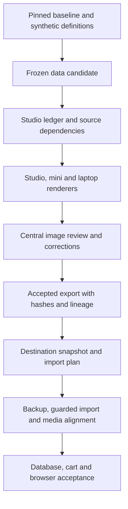

# The doubled catalog

The expansion doubled the canonical catalog from **53,844 to 107,688 product
records**. It is installed on the two existing lab stores, Studio and Comtom.
Installation acceptance was recorded on October 6, 2026. No third store was
created and no products were deleted.

| What matters | Recorded result |
| --- | --- |
| Products | 103,643 simple, 3,995 configurable, 50 bundle |
| Configurable relationships | 27,736 parent-child links |
| Enabled, individually visible products | 79,713 |
| Media | 95,401 distinct accepted JPEGs; 107,455 product assignments per store |
| Disabled media exclusions | 213 reviewed quarantined products plus 20 original imageless records |
| Store verification | Database checks, 15 unsaved cart-model checks and 28 browser checks per store |
| Public download | Expanded media is not published; the public full profile remains 53,844 records |
| Testing coverage | Virtual, downloadable, grouped and several configuration cases remain missing |

The count includes hidden variant children and disabled records. It is not the
number of product cards a shopper will see. An image job can cover multiple
products, and a file can serve multiple roles. Image-job, file, product and role
counts therefore measure different things.

Read the [product coverage plan](../PRODUCT-COVERAGE.md) for the proposed QA
collection, the [completion record](../EXPANSION-CHECKPOINT.md) for exact
acceptance boundaries, or the [documentation index](README.md) for other guides.
The following sections describe the implementation for developers and operators.

## Architecture and responsibilities



| Responsibility | Source |
| --- | --- |
| Data recipe, categories, families and synthetic definitions | `build_expanded_catalog.py`, `expansion_profiles.py` |
| Immutable run descriptor, SQLite ledger and common generation planner | `bulk_expansion_images.py` |
| Local supervision and review-service recovery | `run_expansion_batches.py` |
| Remote batch ownership and validated returns | `remote_image_batch.py`, `run_remote_image_batches.py` |
| Linux rendering | `cuda_image_batch.py` |
| Text/measurement policy, OCR and vision review | `image_policy.py`, `image_ocr.swift`, `image_review.py` |
| Human feedback and targeted correction admissions | `review_rejected_images.py`, `feedback_reprocessing.py` |
| Product-specific QA and corrections | `component_review.py`, `category_image_corrections.py`, `completion_sale_units.py` |
| Finite recovery and explicit quarantine | `authorized_completion.py`, `completion_recovery.py`, `catalog_quarantine.py` |
| Acceptance audit and export | `export_expanded_catalog.py`, `native_metadata.py` |
| Destination diff and native batches | `prepare_expansion_deployment.py`, `run_expansion_native_imports.py` |
| Installation, inverse journal and final verification | `finish_expansion_project.py`, `expansion_*.php`, `build_expansion_inverse.py` |

All source names in this table are relative to `dev/tools/wands_catalog/`.
This is a pinned recipe and a destination-specific installation workflow, not a
general installer for arbitrary production stores. The existing-store update
tools do not replace the public release's empty-store installer.

## Product data and identity

The approved baseline is 53,844 records. The recipe adds 53,844 records through
three lanes: more products in existing categories, new children in existing
configurable families, and products/families in expanded categories. It retains
50 existing bundles. Deterministic SKUs, seeds and manifests identify the inputs;
new synthetic records do not invent upstream WANDS IDs or customer ratings.

### Expansion recipe and category coverage

| Addition lane | New records | Purpose |
| --- | ---: | --- |
| Existing categories | 27,000 | Additional standalone products and new configurable families in the ten original departments |
| Existing-family children | 8,000 | More choices across 1,478 existing configurable families |
| Expanded categories | 18,844 | New standalone products and families in the eight areas below |
| Total additions | 53,844 | 34,844 standalone simples, 2,000 configurable parents and 17,000 simple children |

The 17,000 children include 9,000 children of new families and the 8,000
extensions of existing families. The recipe adds 32 category paths and defines
48,844 new image jobs. New-category records include variant children, so they
are not counts of individually visible listings.

| Expanded area | Category path | Added records |
| --- | --- | ---: |
| Office | Furniture / Office Furniture | 3,200 |
| Entryway | Furniture / Entry & Mudroom Furniture | 2,600 |
| Laundry | Storage & Organization / Cleaning & Laundry Organization | 2,400 |
| Garage | Storage & Organization / Garage & Outdoor Storage & Organization | 2,600 |
| Pet | Pet | 3,000 |
| Balcony | Outdoor / Small-Space Outdoor | 2,200 |
| Garden | Outdoor / Garden | 1,800 |
| Pantry | Kitchen & Tabletop / Kitchen Organization | 1,044 |

`expansion_profiles.py` defines each profile's product class, materials,
construction choices, fictional width/depth/height and baseline price. The
builder deterministically combines profiles, palettes and scales, then validates
exact record counts, SKU/URL uniqueness, options, relationships and job coverage.
Its CLI takes `--baseline-data`, `--baseline-manifest` and a new `--output`
directory; it requires the approved baseline pin. A different source dataset or
broader type coverage needs an explicit recipe change, not a silent pin override.

The builder emits separate simple/configurable/bundle CSVs, new-product and
parent-update CSVs, image jobs, product designs, categories, counts and a pilot
selection. A data candidate explicitly says its media is pending. It must not
be treated as an accepted import packet.

Prices, dimensions and descriptions are synthetic lab data. Dimensions remain
in structured product fields; they must never appear as image annotations.
The [dataset card](../distribution/DATA_CARD.md) explains provenance, and
[NOTICE.md](../../../../NOTICE.md) defines license scope.

## Media generation and acceptance

The Studio owns the authoritative SQLite ledger. Local and remote generators
use the same frozen product briefs and central prompt planner. Remote workers
receive sealed generation packets and reference images, not store credentials
or the complete catalog database. Validated remote returns enter `generated`,
then pass central QA. Transfer success does not confer acceptance.

The Apple Silicon renderers use the pinned MFLUX/MLX environment. The Linux
renderer uses Diffusers/CUDA BF16 with CPU offloading. Cross-backend output is
not assumed byte-identical. Both must satisfy the same product and image rules.
Historical timing samples in the worker guides exclude loading, transfer and
review; they are not completion forecasts.

The shared image policy prohibits visible measurements, text, numerals, units,
dimension lines, rulers, diagrams, logos and watermarks. OCR handles writing;
visual/component checks also assess product identity, material, color, geometry
and the exact sale unit. A clean OCR result alone is insufficient.

Corrections distinguish product parts from props. Monitor risers are separate
raised platforms, optionally carrying a standard black computer monitor; the
variant color belongs to the riser. Shoe-storage benches must have a plausible
seat and usable shoe storage, including shelves or separate cubbies. Product
metadata and imagery must agree on material, color and included components.

Normal attempts are bounded. Diagnosed recovery admissions bind exact jobs,
prior attempts, source bytes and revised prompts; they preserve earlier files
and history. Human Keeps are tied to exact image hashes. Feedback is a revisioned
dataset for correction and calibration, not automatic model training.
See [human review](../HUMAN-IMAGE-REVIEW.md) and the historical
[feedback correction record](../FEEDBACK-REPROCESSING.md).

## Files and evidence

The completed run uses paths below relative to the repository root. These are
private local artifacts, excluded from Git, rather than downloadable resources.

| Path | Contents |
| --- | --- |
| `var/catalog-expansion-20260918/run-v3/run.json` | Frozen candidate, model, packages and review identity |
| `var/catalog-expansion-20260918/run-v3/ledger.sqlite` | Jobs, references, attempts, review and remote ownership |
| `var/catalog-expansion-20260918/human-image-review/` | Exact-image choices, revision history and exported feedback |
| `var/catalog-expansion-20260918/accepted-export-completion-20261003/` | Accepted CSVs, media, manifest, inventory, lineage and quarantine |
| `var/catalog-expansion-20260918/completion-authorized-20261004/completion-acceptance.json` | Both-store completion certificate and pinned evidence/inverse receipts |

An accepted export includes `data/1-simple.csv`, `2-configurable.csv`,
`3-bundle.csv`, `4-media.csv` and `5-merchandising.csv`, plus counts and attribute
options. Content-addressed JPEGs live under `media/wands-expanded/`. A manifest
pins file sizes/hashes, candidate/run identity, corrections, review identity,
metadata normalization and quarantine. Product images are distributed separately
from Git; copying this directory is not release publication.

The final export retains **277 disabled records**: 64 original disabled records
plus 213 reviewed quarantined products. Disabled records and media exclusions
are different counts. Forty-four original disabled records still have media;
only 20 original imageless records and the 213 quarantined products are excluded
from the 107,455 accepted assignments. Quarantine disables reviewed products
without deleting their IDs or historical files, and checks affected family/bundle
dependencies. The manifest records the explicit quarantine pin.

The CSV contract preserves proper quoting for descriptions and nested option or
caption fields. `native_metadata.py` normalizes bounded native metadata before
export, and records those changes in the manifest. Validate both the process
exit and native import results: native validation can report row errors even
when its process exits zero. Never infer acceptance from the exit status alone.

## Inspecting a completed run

Workers are stopped for the completed run. Do not restart them merely to inspect
status. Read the certificate for recorded acceptance and compare its pinned
artifacts when investigating drift. A dated certificate does not prove a store
has remained unchanged since verification.

This command reads the central ledger without loading a model or updating it:

```sh
python3 - <<'PY'
import sqlite3
from pathlib import Path
ledger = Path('var/catalog-expansion-20260918/run-v3/ledger.sqlite').resolve()
with sqlite3.connect(ledger.as_uri() + '?mode=ro', uri=True) as db:
    for state, count in db.execute('SELECT state, COUNT(*) FROM jobs GROUP BY state'):
        print(state, count)
PY
```

The export inspector performs a deeper artifact audit and writes a new
`export-readiness.json` snapshot. It does not generate images or install products.
Use the run's pinned Python environment:

```sh
/Users/matt/code/mageos-latest/.venv-imagegen/bin/python \
  dev/tools/wands_catalog/export_expanded_catalog.py \
  --run var/catalog-expansion-20260918/run-v3
```

No `--output` is supplied here. Supplying it creates an export in a new output
directory and requires the complete media acceptance contract to pass.

## Existing-store installation and recovery

The coordinator is restricted to the Studio root
`/Users/matt/code/mageos-latest` and Comtom root
`/opt/comtom/stores/relevance/src` (container PHP root `/var/www/html`). It binds
the approved candidate and accepted export, captures destination-specific
snapshots, and prepares different insertion/update/conversion plans for each
baseline. A shared blind import cannot account for their different starting data.

Before application, it retains private database/module backups and catalog-row
journals, ensures attribute options and compiled DI agree, and stages immutable
media. Native import phases respect product dependencies. Existing-stock
preservation applies to known existing WANDS SKUs, leaving new-stock initialization
to the importer. Legacy/MSI stock processing must be covered by the plugin and
its tests; a media-only import can otherwise cause stock side effects.

Media verification checks base, small and thumbnail roles against accepted file
hashes. Navigation, index state, cart-model and rendered browser acceptance
follow database identity/link/stock/protected-data checks. Native validation
writes staging tables; it is not a read-only production probe.

`finish_expansion_project.py` accepts `--run`, `--package` and a **new** private
`--output` directory. Without `--apply`, it verifies the accepted export and
probe cases without applying installation. `--watch` waits for the export.
`--apply` writes to both existing stores. A run-level lock prevents concurrent
installations. Its CLI is an operator interface, not permission to reapply the
completed installation.

On partial failure, inspect the actual destination state and private command
logs. The coordinator records the changed rows and prepares an inverse even if
installation failed. It does not automatically restore the database. Recovery
tools reconcile actual applied metadata or media before continuing; they do not
blindly repeat the failed import. Review `--reconcile-local` and
`--resume-local-media` inputs against their original snapshots before use.

The completion certificate records ordered rollback chains. Apply newest inverse
stages before older ones, using their exact journals and receipts. Restoring an
old full database or ledger over later progress can discard unrelated changes.
Backups and inverse receipts must remain private and available before any further
store mutation. This guide does not authorize that mutation.

## Verification and remaining coverage

Database acceptance checks exact WANDS membership, original IDs, type/link
counts, existing stock and unrelated/protected data. The unsaved cart probes
exercise eleven department samples and four configurable selections without
saving carts, orders or reservations. Browser checks inspect actual categories,
product pages, variant selections and search results. Media acceptance checks
322,365 image roles per store. These are complementary success surfaces.

The completed checks do not qualify checkout, payments, search ranking, every
variant, every device, every tax/currency setup or every core product type.
The [coverage audit](../PRODUCT-COVERAGE.md) proposes a small QA collection for
the missing cases. No such fixtures have been added by the documentation work.

For local regression commands, PHP compatibility and fixture requirements, see
[CONTRIBUTING.md](../../../../CONTRIBUTING.md). For the full recovery chronology,
see [historical expansion notes](EXPANSION-HISTORY.md).
